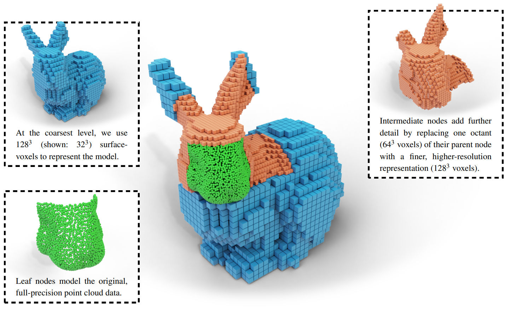
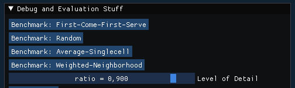

# CUDA LOD Generation

This repository contains the source to our paper ["GPU-Accelerated LOD Generation for Point Clouds"](https://www.cg.tuwien.ac.at/research/publications/2023/SCHUETZ-2023-LOD/SCHUETZ-2023-LOD-paper.pdf). 

__About__: We introduce a GPU-accelerated LOD construction process that creates a hybrid voxel-point-based variation of the widely used layered point cloud (LPC) structure for LOD rendering and streaming. The massive performance improvements provided by the GPU allow us to improve the quality of lower LODs via color filtering while still increasing construction speed compared to the non-filtered, CPU-based state of the art.#

__Background__: LOD structures are required to render hundreds of millions to trillions of points, but constructing them takes time.

__Results__: LOD structures suitable for rendering and streaming are constructed at rates of about 1 billion points per second (with color filtering) to 4 billion points per second (sample-picking/random sampling, state of the art) on an RTX 3090 -- an improvement of a factor of 80 to 400 times over the CPU-based state of the art (12 million points per second). Due to being in-core, model sizes are limited to about 500 million points per 24GB memory.

__Discussion__: Our method currently focuses on maximizing in-core construction speed on the GPU. Issues such as out-of-core construction of arbitrarily large data sets are not addressed, but we expect it to be suitable as a component of bottom-up out-of-core LOD construction schemes.



## Getting started

To test with your own point cloud in LAS format:

* Change path to point cloud in [main_simlod.h](https://github.com/m-schuetz/CudaLOD/blob/main/src/main_simlod.h#L240-L258)
	* Look for ```// WHATEVER``` and modify the path.
* Modify ```#define MAX_BUFFER_SIZE 15'000'000'000``` in [sampling_cuda_nonprogressive.h](https://github.com/m-schuetz/CudaLOD/blob/0af1bb1dc46db9c59d184ba2f210ec3bf775f13e/modules/simlod/sampling_cuda_nonprogressive/sampling_cuda_nonprogressive.h#L50) to a value that fits your GPU and point cloud. 
	* ```MAX_BUFFER_SIZE``` needs to be about 28 * numPoints bytes. This buffer holds intermediate data such as the partitioned/sorted point cloud, and the output data, i.e., the octree and voxels. Actual required values depend on the amount of generated voxels, but these values worked for us:
		* 550 million points and high depth complexity: MAX_BUFFER_SIZE = 15GB; total GPU memory at least 24GB
		* 1 billion points and 2.5D LIDAR data: MAX_BUFFER_SIZE = 25GB; total GPU memory at least 48GB
	* ```MAX_BUFFER_SIZE``` must be at most 2/3 of your total GPU memory. Because CudaLOD needs at least 16 * numPoints additional memory for another buffer with the input data.
* Set Configuration to "Release". 
* Compile and run
* Hope it works. Check console that loading does work - It will print a message every 10M points that are loaded from disk.
* After the point cloud is loaded, LOD will be constructed with the first-come strategy. You can then try different sampling strategies and adjust LOD in the GUI.



## Data Sets

For test data sets, I recommend looking at some data sets over at [https://opentopography.org/](https://opentopography.org/). Particularly interesting are photogrammetry and terrestrial laser scans, as well as colored LIDAR data.
* [Photogrammetry and Terrestrial Laser scans](https://portal.opentopography.org/dataCatalog?platforms=3&platforms=4&formats=0)
* The [CA21 Bunds](https://portal.opentopography.org/datasetMetadata?otCollectionID=OT.092021.32611.1) data set is also available for download at Open Topography. For our benchmarks, we used a subset of 975 million points, we will upload this subset soon.

Please note following limitations:
* You'll need about 4.8GB GPU memory for every 100 million points. 
* The data set needs RGB color data, which is not always available in aerial LIDAR data sets. Photogrammetry nearly always has colors, terrestrial laser scans also tend to have colors.


## Implementation

* The relevant code is in modules/simlod/sampling_cuda_nonprogressive
* CUDA code for LOD generation: 
	* ```kernel.cu```, 
	* ```split_countsort_blockwise.h.cu```
	* All the ```voxelize_<xxx>_blockwise.cu```
* CUDA code for point cloud rendering: ```render.cu```. Changes are immediately applied by saving this file. 
* Host-code is in ```sampling_cuda_nonprogressive.h```

## Algorithm Overview


This method first splits the point cloud into leaf nodes of an octree via hierarchical counting sort, and then populates inner nodes with coarser voxelized representations of their children. Hierarchical counting sort allows splitting points into an octree with 8 levels in just two iterations over all points, and one additional iteration over points for any additional 4 octree levels. A depth of 12 suffices for all our test data sets with up to 1 billion points. 

## Citation

Paper: ["GPU-Accelerated LOD Generation for Point Clouds"](https://www.cg.tuwien.ac.at/research/publications/2023/SCHUETZ-2023-LOD/SCHUETZ-2023-LOD-paper.pdf)

Bibtex:
```
@misc{SCHUETZ-2023-LOD,
	title =      "GPU-Accelerated LOD Generation for Point Clouds",
	author =     "Markus Schütz and Bernhard Kerbl and Philip Klaus and Michael Wimmer",
	year =       "2023",
	month =      feb,
	keywords =   "point cloud rendering, level of detail, LOD",
	URL =        "https://www.cg.tuwien.ac.at/research/publications/2023/SCHUETZ-2023-LOD/",
}
```
